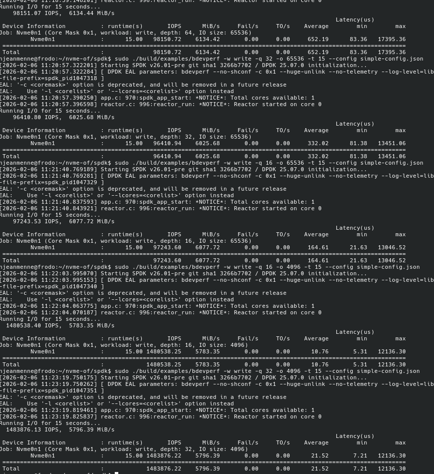

# Direct device access from the SmartNIC towards datacenter disagregation

## Master's thesis meeting : week 1

### Nicolas Jeanmenne

---
## Table of contents

<!-- 

 -->

- [Bdevperf benchmarks](#bdevperf-benchmarks)
- [Basic file transfer](#basic-file-transfer)
- [Blobstore](#blobstore)
- [Conclusion](#conclusion)
- [TODOs for week 1](#todos-for-week-1)

---
# Bdevperf benchmarks

- Goal : match performances with my own implementation
- Sketchy screenshot for this week, proper python measurement skip later
- Focusing on the C code

---

# Basic file transfer

- Writing code on the bdev layer
- Allow one file to be stored into the SSD
- My estimation : code will be functional for next meeting

---

# Blobstore

- The big next step
- Goal : implement a filesystem with SPDK blobstore
- Will be useful for file synchronization

---

# Fosdem side quests

- Talks about hardware offloading
- One interesting about zero-copy optimization
- Discovered CephFS there but idk if it's useful

---

# Conclusion

- Gained some experience with SPDK ecosystem
- Results ASAP

---

# TODOs for week 1

- Demo for next week working

---

# That's all for today !
