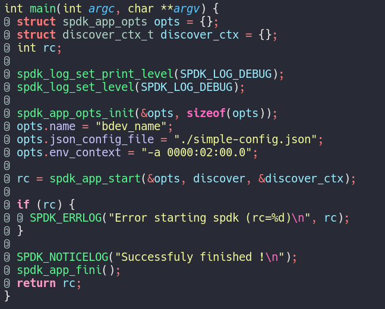
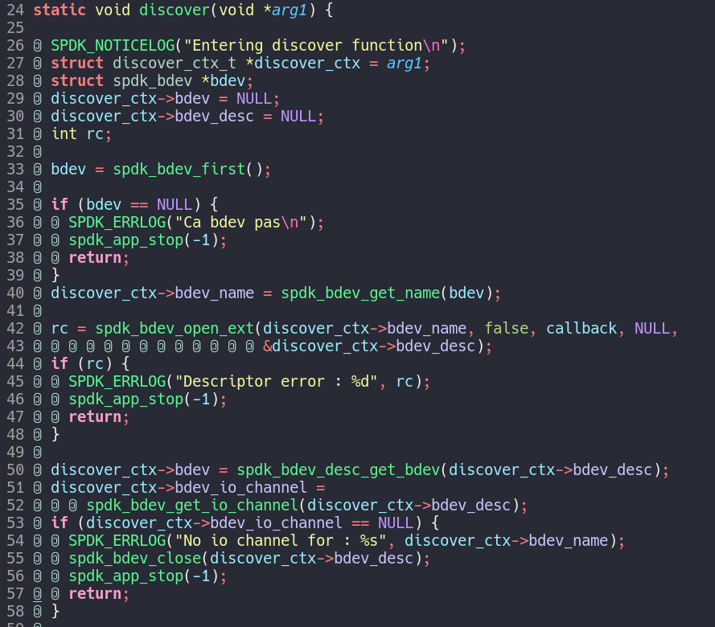
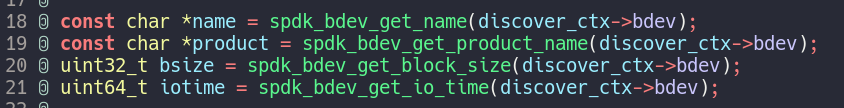
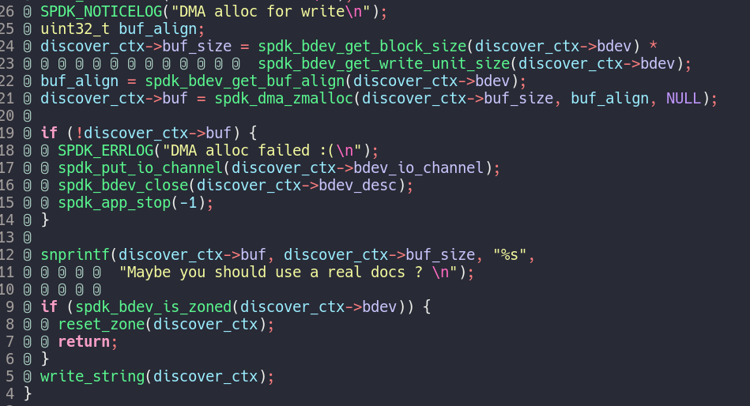
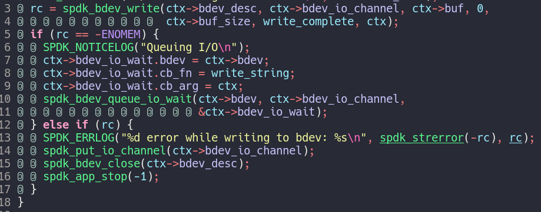
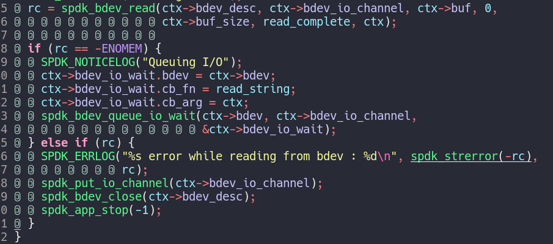
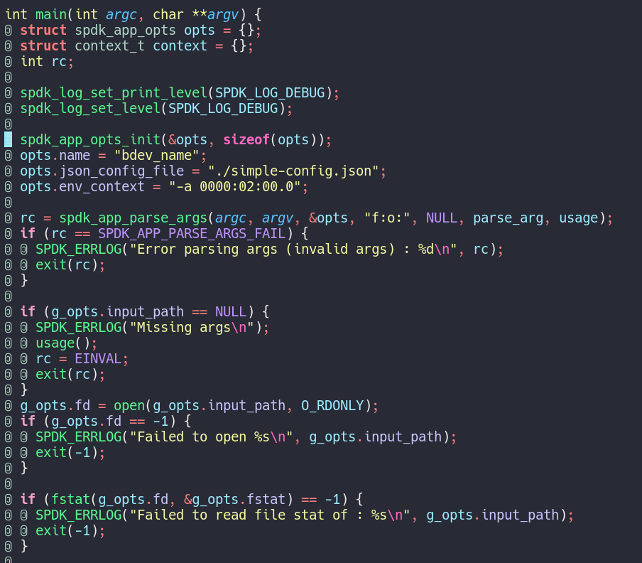
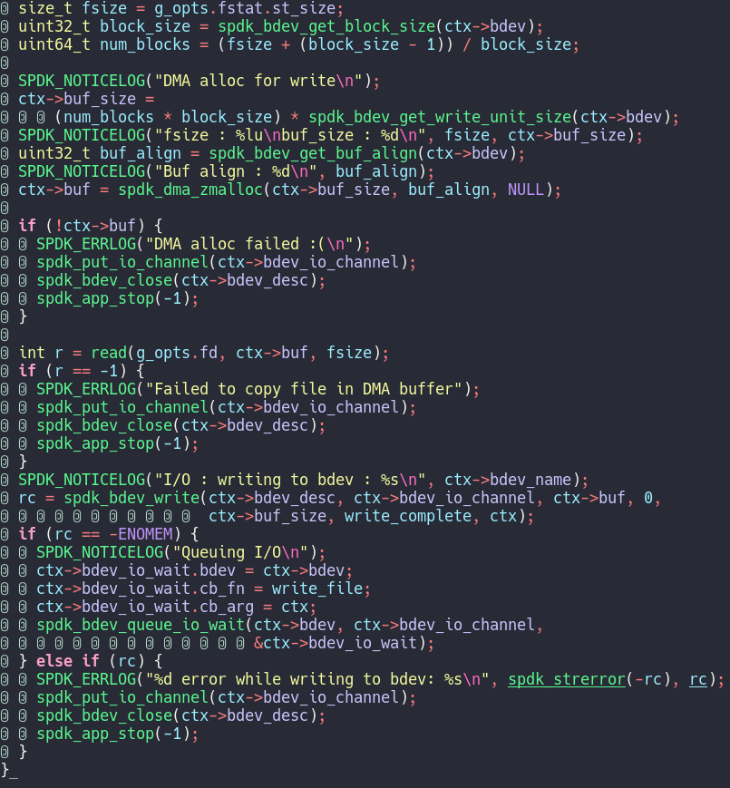
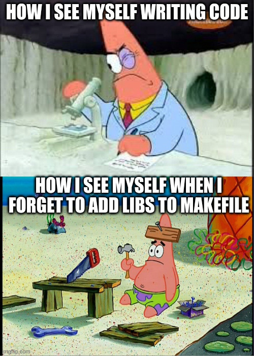

# Direct device access from the SmartNIC towards datacenter disagregation

## Master's thesis meeting : week 2

### Nicolas Jeanmenne

---
## Table of contents

- [Retrieve bdev info](#retrieve-bdev-info)
  - [Setup](#setup)
  - [Descriptor and stuff](#descriptor-and-stuff)
  - [Retrieve info](#retrieve-info)
- [Demo #1 !](#demo-1-)
- [Write and read a string](#write-and-read-a-string)
  - [Buffer allocation](#buffer-allocation)
  - [Write process](#write-process)
  - [Read process](#read-process)
- [Demo #2 !](#demo-2-)

- [Write and read a file (cp)](#write-and-read-a-file-cp)
  - [Modifications in main](#modifications-in-main)
  - [Modifcation for buffer alloc](#modifcation-for-buffer-alloc)
- [Demo #3 !](#demo-3-)
- [Conclusion](#conclusion)
- [TODOs for week 3](#todos-for-week-3)

---
# Retrieve bdev info

- Get name, product, block, ... of bdev
- No I/O yet
- File : `src/get_info.c`

---
## Setup

- Opts and context struct
- Attach a bdev from `simple-config.json`
- Start discover function

---
## Descriptor and stuff

- Take first bdev available
- Open descriptor in order to get info
- Open io channel

---

## Retrieve info

---

# Demo #1 !

---

# Write and read a string

- Start from previous code
- Write a *(fixed)* string into a DMA buffer
- Reset the same buffer
- Read the content of bdev into the latter
- File : `src/rwstring.c`
  
---

## Buffer allocation

- Set up a buffer to print the string into
- Go to `write_string`
- If zoned bdev : reset zone and go to `write_string`

---

## Write process

- Queuing write request if no memory available
- Callback function on completion

---

## Read process

- Buffer content zeroed in write callback
- Then same idea but with read call

---

# Demo #2 !

---

# Write and read a file (cp)

- Same idea but with an arbitrary file
- File : `src/basic-cp.c`

---
## Modifications in main

- Parse arg for file input (from linux fs)
- Get the file stat

--- 

## Modifcation for buffer alloc

- Allocation must be a multiple of `block_size`
- Put content into the buffer (thus involving host CPU for this step)
- Same write and read approach as before

---

# Demo #3 !

---

# Conclusion

- We can copy a file !
- Writing SPDK code is quite fun
- But non-negligible time taken to understand what function does what

---

# TODOs for week 3

- Add a flag to retrieve file from bdev
- Performances evaluation
- ...

---

# That's all for today !

