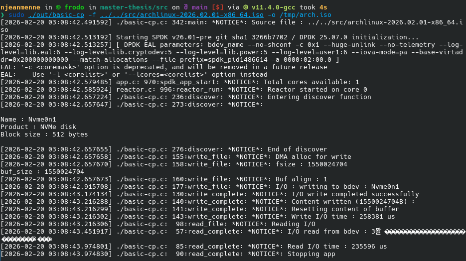
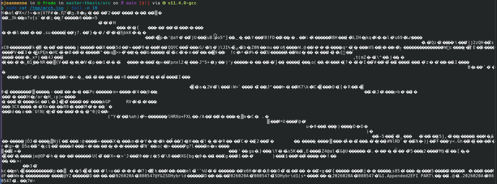
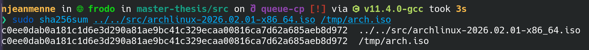
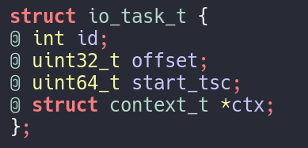
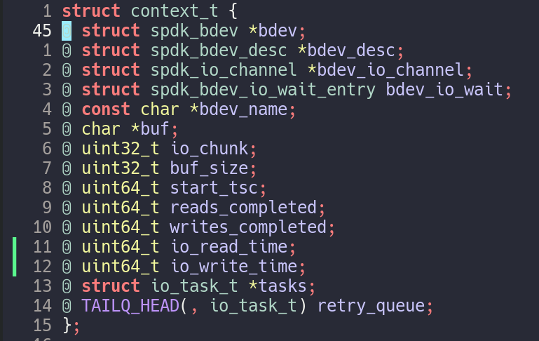
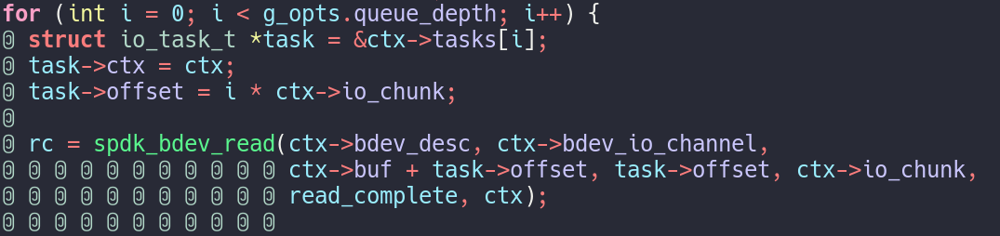

# Direct device access from the SmartNIC towards datacenter disagregation

## Master's thesis meeting : week 3

### Nicolas Jeanmenne

---
## Table of contents

- [Summary from previous week](#summary-from-previous-week)
  - [Results](#results)
- [`basic-cp` updates](#basic-cp-updates)
  - [Example](#example)
  - [`O_DIRECT` flag](#o_direct-flag)
- [Write and read time executions](#write-and-read-time-executions)

- [`queue-cp`](#queue-cp)
  - [Modifications in code](#modifications-in-code)
- [Conclusion](#conclusion)
- [TODOs for week 4](#todos-for-week-4)

---

# Summary from previous week

- Wrote code to read / write string and files from bdev layer
- Easiest way possible
- Inspiration straight from Intel's code

---

## Results

- 3 binaries : `get_info`, `rwstring` and `basic-cp`
- `basic-cp` is the most interesting program
  - Write an arbitrary file to a bdev
  - Read it back

---

# `basic-cp` updates

- Added the output flag 
- Bdev content copied wherever you want

---

## Example 

- File for test : archlinux iso (~1.5GB)

---

## Example 

- Content is correctly written in output path
- Identicals checksums in lower picture

---

## `O_DIRECT` flag

- `O_DIRECT` : tells to do File I/O to/from user space
- Used without `O_SYNC`, we don't actually get the file on the fs
- Both options don't improve performances

---

# Write and read time executions

- Something bothered me while I was running program
- For big files, write and read performances are pretty similar
- For string and small files, read is $>1000$ times slower than write

---

# `queue-cp`

- Improvement of `basic-cp`
- Instead of sending one I/O request, split it in a queue
- Still WIP

---

## Modifications in code

- New struct to manage each I/O task
- Store number of operations completed and cumulative time in context struct
- Split read / write by queue depth

---

# Conclusion

- This week was mostly about finding flaws and optimizing `basic-cp`
- Thought it was more or less necessary before moving on blobstore

---

# TODOs for week 4

- KV store implementation
- 
  - Goal : persistent superblock and store
- ...

---

# That's all for today !
