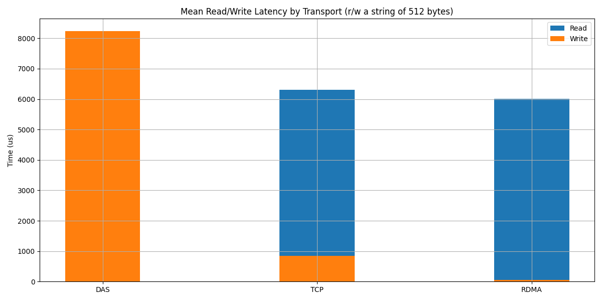

# Direct device access from the SmartNIC towards datacenter disagregation

## Master's thesis meeting : week 5

### Nicolas Jeanmenne

---
## Table of contents

- [SPDK on SmartNIC](#spdk-on-smartnic)
- [NVMe-oF](#nvme-of)
- [Conclusion](#conclusion)
- [TODOs for week 6](#todos-for-week-6)

<!-- 

 -->

---

# SPDK on SmartNIC

- Combo of reverse tunnel for connection and broken apt deps was a pain to set up
- But it's working now, setup is finished

---

# NVMe-oF

- NVMe-oF is working, but execution time is very high
- RDMA is the best option so far

---

# Conclusion

- Now we can play with NVMe-oF/RDMA !

---

# TODOs for week 6

- Find how to expose the FS to the SNIC
- Test KV store with NVMe-oF

---

# That's all for today !
