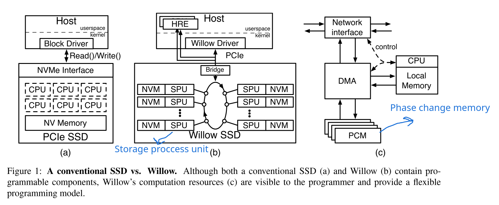

# Direct device access from the SmartNIC towards datacenter disagregation

## Master's thesis meeting : week 11

### Nicolas Jeanmenne

---
## Table of contents

<!-- 

 -->

---

# About computational SSD

- More or less the same as accelerator + NVMe-oF
- Write latency improved in one of willow SSD app (*Caching*) because they use it as a custom cache 

---

# About computational SSD (cont°)

- Another SSD app (*Append*) about file system offload
  - If physical length > logical length, then special write issued and updated length logged
  - If not, host-side application invoke the file system
- Not directly linked with file synchronization of IO-TCP but could be a source of inspiration
- [https://www.usenix.org/system/files/conference/osdi14/osdi14-paper-seshadri.pdf](https://www.usenix.org/system/files/conference/osdi14/osdi14-paper-seshadri.pdf)

---

# That's all for today !
