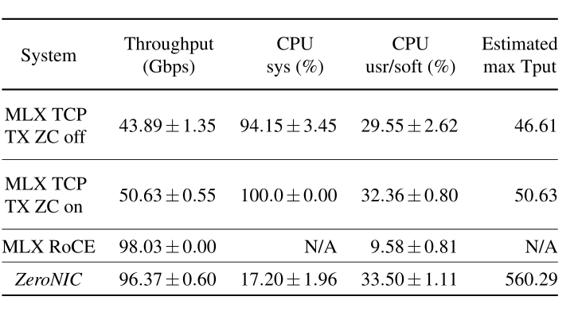
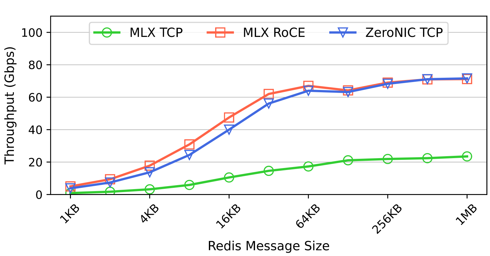
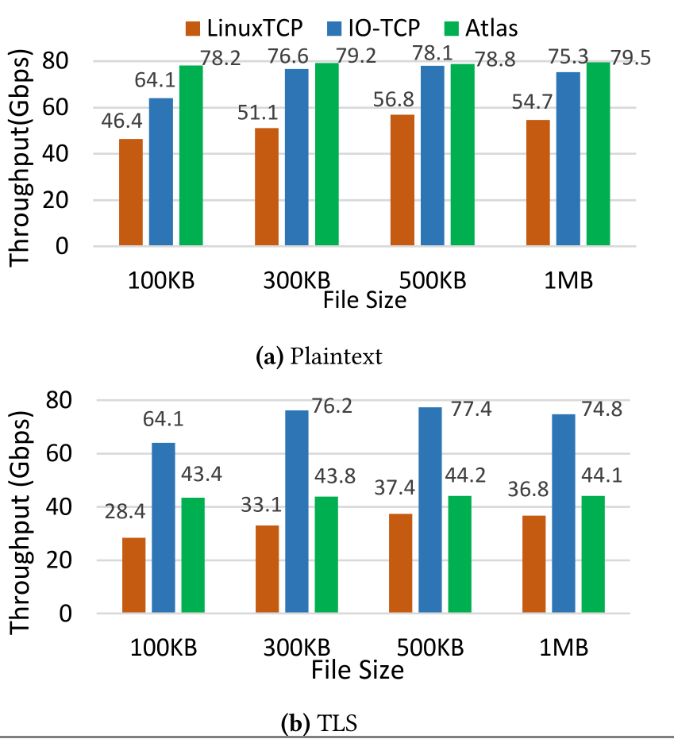

# Direct device access from the SmartNIC towards datacenter disagregation

## Master's thesis meeting : week 3

### Nicolas Jeanmenne

---
## Table of contents

1. [High-throughput and Flexible Host Networking for Accelerated Computing](#high-throughput-and-flexible-host-networking-for-accelerated-computing)
    1. [Overview](#overview)
    2. [ZeroNIC](#zeronic)
        1. [Details](#contribution)
        2. [Throughput and ressources allocation](#throughput-and-ressources-allocation)
        3. [Example](#example)
        4. [Why does it matter ?](#why-does-it-matter-)

2. [Rearchitecting the TCP Stack for I/O-Offloaded Content Delivery](#rearchitecting-the-tcp-stack-for-io-offloaded-content-delivery)
    1. [Overview](#overview-1)
    2. [IO-TCP](#io-tcp)
        1. [Details](#io-tcp)
        2. [Throughput and perfomances](#throughput-and-perfomances)
        3. [TLS / encryption](#tls--encryption)
        4. [Why does it matter ?](#why-does-it-matter--1)
3. [Papers that might be interesting](#papers-that-might-be-interesting)
4. [TODOs for week 5](#todos-for-week-5)
5. [A few questions](#a-few-questions)

---

# High-throughput and Flexible Host Networking for Accelerated Computing

---

## Overview

- Current systems : force to choose between RDMA (fast but not flexible) vs TCP stack (flexible but slow)
- **Key idea :** separation of data and control path
- Implementation and evaluation of ZeroNIC

---

### ZeroNIC

- FPGA-based with own software stack
- Zero-copy data path
  - NIC splits header and payload
  - Specialized MS list and MR table to track packets
  - DMA to application buffers
- Combines high perfomance with high flexibility
  - Perfomances $\Rightarrow$ RDMA-like througput without HoL, deadlocks, go-back N expensive strategy...
  - Flexibility $\Rightarrow$ Integration for any protocol in kernel / user space / accelerator

---
### ZeroNIC

#### Throughput and ressources allocation

- 17% CPU utilization vs near 100% for Linux TCP at same throughput

---
### ZeroNIC

#### Example

---
### ZeroNIC

#### Why does it matter ?

- Useful for disagregation
  - More data movement between datacenter components where ZeroNIC handles it better than TCP
- Break coupling between data and control path
- Allow to add / change protocols without replacing hardware
- SmartNICs could implement the same separation logic

---

# Rearchitecting the TCP Stack for I/O-Offloaded Content Delivery

---

## Overview

- Current systems : $\approx$ 70 % CPU cycles spent on disk and I/O networks operations
- **Key idea :** split TCP stack between disk and Net I/O to a smartNIC and the rest to CPU
  - *Note : full-stack offloading isn't efficient due to limited ressources*
- Similar approach, division between data and control plane

---

### IO-TCP

- Control plane $\Rightarrow$ on CPU
  - Connection management, congestion, reliability, error handling
- Data plane $\Rightarrow$ on smartNIC
  - disk I/O, data transfer, delay correction
- Uses P2PDMA to communicate directly with NIC / disk
  - No CPU involved in the process
- Zero-copy DMA implementation with DPDK
- Allow flexibility for file and non-file transfert throught an API
- Special command packets on the NIC stack

---

### IO-TCP

#### Throughput and perfomances

- CPU stats :
  - IPC improved by $\approx$ 58 %
  - LLC miss rate improved by $\approx$ 27 % (DDIO pollution avoided)
- Control plane runs faster allowing smaller RTT and larger windows
- *BlueField-2 limits to $\approx$ 80 Gbps bandwith*

---
### IO-TCP

#### TLS / encryption

- Offload TLS keys encryption to the smartNIC (with DPDK)
  - Handshake stays in the control plane (CPU)
  - Need specific hardware to handle encryption
- Better throughput than Linux TCP / Atlas

---

### IO-TCP

### Why does it matter ?

- Division of planes directly through a smartNIC
- Data can be handled without the CPU
- TCP stack can be run on a smartNIC
- Encryption can be offloaded efficiently

---

## Papers that might be interesting

- *Lynx: A SmartNIC-driven Accelerator-centric Architecture for Network Servers*. [DOI link](https://doi.org/10.1145/3373376.3378528)
- *UNO: Unifying Host and Smart NIC Offload for Flexible Packet Processing* [DOI link](https://doi.org/10.1145/3127479.3132252)
- *OSMOSIS: Enabling Multi-Tenancy in Datacenter SmartNICs* [Link](https://www.usenix.org/system/files/atc24-khalilov.pdf)
- *A {High-Speed} stateful packet processing approach for tbps programmable switches.* [Link](https://www.usenix.org/system/files/nsdi23-scazzariello.pdf)

---

# Conclusion

- Splitting control and data planes is critical
  - Use CPU only for complex task
- Zero-copy data improve throughput
- Both methods give more flexibilty than "traditionals ways"
- SmartNICs are the main component for data disagregation
- Today's world need to move from monolithic CPUs for networks I/O

---

## TODOs for week 5

- Analyze papers in previous slide
- $3^{rd}$ pass on ZeroNIC and TCP I/O offload papers
- *Reorganize work time allocation : reading papers take much more time than I expected*
- Start writing SOTA

---

## A few questions

- Can the work done for the thesis (code, research, ...) be open-source, ideally on a GPLv3 license ?
- Multiple papers come from Usenix, do you recommend any other association / conference ?

---

# That's all for today !
