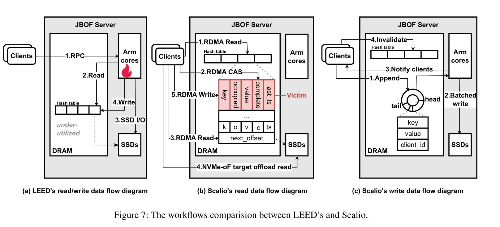

# Direct device access from the SmartNIC towards datacenter disaggregation

## Master's thesis meeting : week 7

### Nicolas Jeanmenne

---
## Table of contents

- [State of the art](#state-of-the-art)
- [SOTA reviews](#sota-reviews)
- [How do Scalio does NVMe-oF in the ARM cores ?](#how-do-scalio-does-nvme-of-in-the-arm-cores-)
- [Why does TCP-IO needs a smartNIC ?](#why-does-tcp-io-needs-a-smartnic-)
- [Conclusion](#conclusion)
- [TODOs for week 9](#todos-for-week-9)

<!-- 

 -->

---

# State of the art

- Started writing SOTA about why disaggregated architecture matters, as well as challenges that arise with these patterns
and contributions
- Working on linking papers innovations by core concepts as asked
- Let's take a look at the $\LaTeX$

---

# SOTA reviews

$\LaTeX$ sources (and PDF) will be available for reviews through the year on my [github repo](https://github.com/nicojmn/master-thesis/tree/main/sota)

---

# How do Scalio does NVMe-oF in the ARM cores ?

- With standard NVMe-OF ARM cores are heavily solicited
  - Cores handle requests through a kernel module / userspace (via SPDK) $\Rightarrow$ many cycles consumed
  - Becomes a bottleneck with many SSDs
- Scalio offload NVMe commands to the host channel adapter hardware
  - Clients read an in-memory hash table containing SSD index (the RDMA call discussed in previous meeting)
  - If cache miss then NVMe-OF TO call from the SSD

---

---

# Why does TCP-IO needs a smartNIC ?

- SmartNIC are well suited for the job, but authors state that any programmable device that can perform direct I/O for disks and network can be used.
  - Convenience use for P2PDMA and network I/O
- Highly optimized CPU-only approach can even be as performant (like we saw with ATLAS server in week 3)
- SmartNIC still outperforms classic Linux TCP and ATLAS for TLS

---

# Conclusion

- SmartNIC may be not as much important than other types of accelerators
- Big picture for disaggregation becomes more clear

---

# TODOs for week 9

- Investigate SPDK to write data blocks from the smartNIC towards NVMe on *Frodo*
- Reproduce experience from *Scalio*
- Find how important is the smartNIC related to the thesis
- Investigate NVMe Computational SSD (it is interesting for our storage disaggregation ?)

---

# That's all for today !
